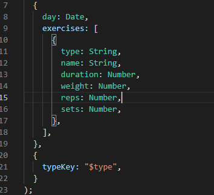

## Fitness Tracker
This is a fitness tracker app to help you count those steps as you herd cats!

## Getting Started

Add a workout, get off your laptop and start walking!

# Adding a unique id to each note

# My Portfolio Link
* [Portfolio](https://alix1713.github.io/alix/)
* [Github](https://www.github.com/Alix1713/alix)

## Built With

* [HTML](https://www.w3schools.com/html/html_intro.asp)
* [CSS](https://css-tricks.com/snippets/css/complete-guide-grid/)
* [UC Berkeley Extension Program](https://extension.berkeley.edu/)
* [NPM package](https://www.npmjs.com/package/uuid)

## Alix Friedman

* [My GitHub](https://www.github.com/Alix1713)
* [My LinkedIn](https://www.linkedin.com/in/alix1713)

## Acknowledgments

*My TA Manuel for helping me figure out why it was working locally but not when deployed.
