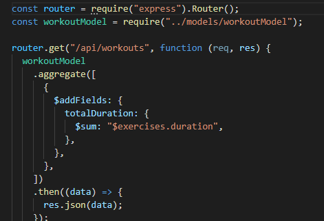

## Fitness Tracker
This is a fitness tracker app to help you keep track of different workouts.

## Getting Started
This project has been deployed on heroku using mongo db atlas. The models I created to track the workouts follow a
Mongoose schema. It takes the data input by the user and creates a workout then populates it into a chart for easy
viewing. With my api routes I used an aggregate sum function to total the workout duration.

# Workout Model Route

# My Portfolio Link
* [Portfolio](https://alix1713.github.io/alix/)
* [Github](https://www.github.com/Alix1713/alix)

## Built With

* [Mongo DB Atlas](https://www.mongodb.com/atlas/database)
* [Aggregate Sum](https://docs.mongodb.com/manual/reference/operator/aggregation/sum/)
* [Mongo Schema Query](https://docs.mongodb.com/manual/tutorial/query-documents/)
* [NPM package](https://www.npmjs.com/package/uuid)
* [Routes using express](https://expressjs.com/en/guide/routing.html)

## Alix Friedman

* [My GitHub](https://www.github.com/Alix1713)
* [My LinkedIn](https://www.linkedin.com/in/alix1713)

